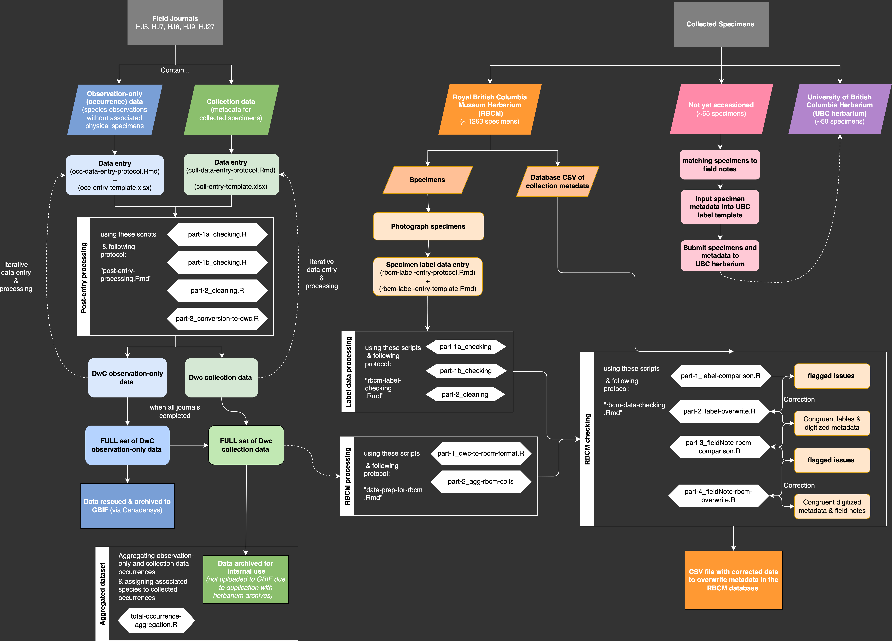

---
---
---

# Living Data Rescue: Harvey_Janszen_Legacy_Project

This repository contains data entry templates, digitization protocols, data processing scripts, and digitized data outputs for the field notes of Harvey Janszen (1946-2021)

The three types of data being entered & processed by these scripts and protocols are...

1)  Observation-only occurrence data (in field journals)

2)  Field notes of collected specimens (in field journals)

3)  Digitized herbarium label data (on specimen photographs)

These data are located in 5 different field journals: 

HJ5 = Flora of Saturna (1973-1981)
HJ7 = Journal ca. 1981-1996
HJ8 = Journal ca. 1996-2000
HJ9 = Unbound field notes ca. 1999-2003
HJ27 = Field notes ca. 2003-2017

The following diagram shows the general workflow for this project

